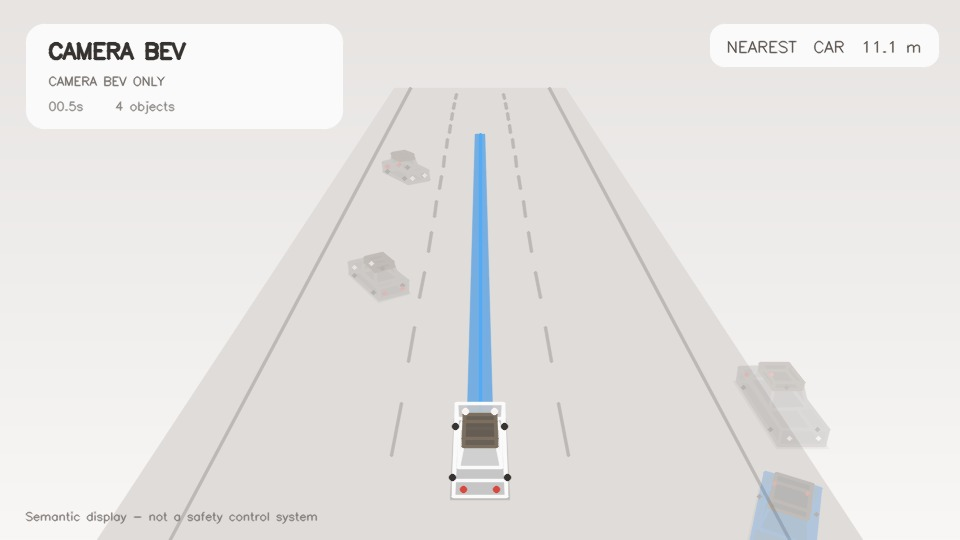
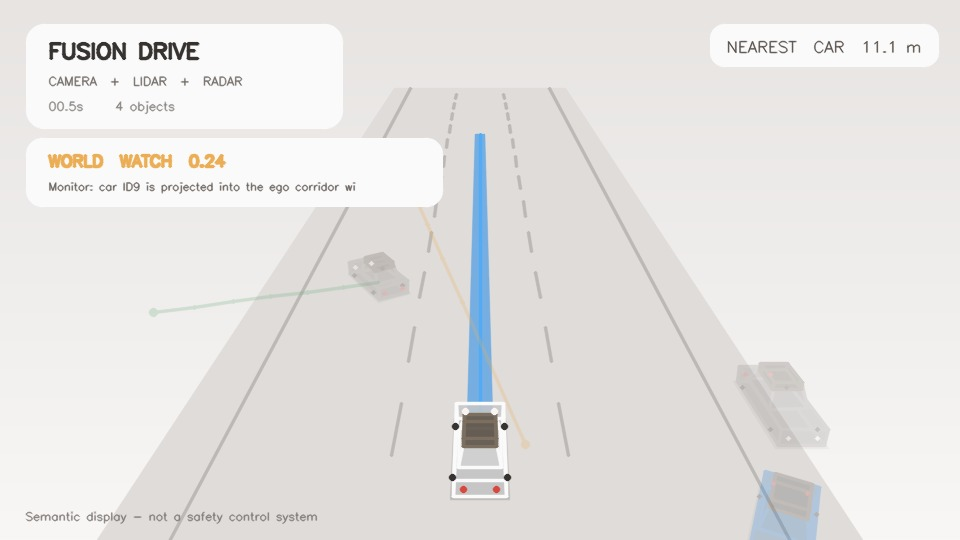
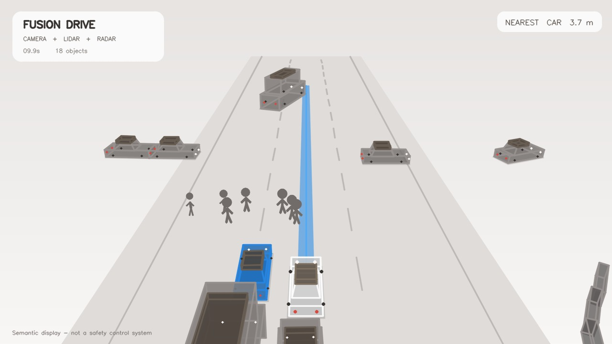

# Multi-Camera, LiDAR, and Radar BEV Perception for Autonomous Driving

This repository contains an offline autonomous-driving perception prototype with
three connected modules:

```text
BEV Perception -> World Prediction -> Semantic Simulation / Visualization
```

The project is useful for MyRide-style perception prototyping, demonstration,
and future VLA/world-model experiments. It is not a real-vehicle safety
controller and must not be used for road-vehicle control.

## Demo Videos

| Module | Preview | Video |
|---|---|---|
| Camera BEV / BEV Perception |  | [camera-bev-semantic-style.mp4](docs/videos/camera-bev-semantic-style.mp4) |
| World Prediction |  | [world-model-lite-stabilized.mp4](docs/videos/world-model-lite-stabilized.mp4) |
| Semantic Simulation / Visualization |  | [semantic-surround-simulation-style.mp4](docs/videos/semantic-surround-simulation-style.mp4) |

For a feature-by-feature code map and runtime-flow explanation, see
[docs/CODE_MAP.md](docs/CODE_MAP.md).

## Module 1: BEV Perception

The BEV perception module converts sensor observations into a shared
ego-vehicle bird's-eye-view representation.

Implemented components:

- Camera-only BEV projection with `CameraBEVProjector`.
- Optional LiDAR rasterization into occupancy, height, and density grids.
- BEVFusion prediction loading for camera+LiDAR 3D object detections.
- Optional radar velocity association for tracker updates.
- Timestamp-aware multi-object tracking with a constant-velocity Kalman filter
  and class-aware Hungarian matching.

Coordinate convention:

```text
x = forward from ego vehicle
y = lateral left/right
z = upward
unit = metres
BEV canvas = configured by bev.width_px, bev.height_px, x/y min/max
```

All sensor branches should land in the same ego-frame metric BEV contract:

```text
sensor sample -> calibration -> ego-frame metric coordinates -> shared BEV grid
```

The current `configs/camera_only.yaml` demo uses the same BEV canvas as the main
pipeline, but its four camera `destination_quads` are presentation placeholders.
For real MyRide cameras, replace those quadrilaterals with calibrated
camera-to-ego ground-plane projections or a learned view-transformer output that
lands in the same metric BEV grid.

## Module 2: World Prediction

The world prediction module is implemented as
`parking_bev.world.world_model.WorldModelLite`. It consumes tracked objects from
the BEV perception layer and predicts short-horizon future motion.

Inputs:

- Tracked object position, size, yaw, class, score, and velocity.
- Ego velocity estimated from consecutive ego poses.
- Display stability state used to suppress risk spikes from one-frame
  detections.

Method:

```text
current track state + ego velocity
  -> constant-relative-velocity rollout for 3 seconds
  -> safety-envelope / ego-corridor overlap test
  -> clear / watch / caution / critical risk level
```

Outputs include future centers, relative velocity, time-to-risk, minimum
clearance, risk score, and a human-readable advisory. Newly confirmed tracks
fade in before they can trigger strong risk warnings, reducing sudden object
flashes and risk jumps.

## Module 3: Semantic Simulation / Visualization

The simulation layer renders perception outputs into a clean driving-scene view.
This is a visual simulation/debug environment, not a closed-loop physics
simulator like CARLA.

Implemented components:

- `Semantic3DRenderer` renders a stylized road, ego vehicle, detected vehicles,
  pedestrians, 3D boxes, object history, and HUD panels.
- `stabilized_snapshot_to_ego` converts tracker outputs into renderable tracks
  with fade-in/fade-out display alpha.
- Optional engineering mode can show LiDAR points, radar points, object IDs,
  velocity, distance, and track history.
- Optional camera-comparison mode can place raw camera views next to the
  rendered semantic scene.

## Installation

The complete runnable source code is included in this repository under
`src/parking_bev`, `scripts`, `configs`, and `tests`.

Large external assets are intentionally not committed:

- nuScenes data.
- BEVFusion checkpoints.
- Generated BEVFusion prediction JSON files under `output/`.
- Local virtual environments and generated videos under `output/`.

Windows PowerShell setup:

```powershell
git clone https://github.com/lengyuely2/multi-camera-lidar-bev-perception.git
cd multi-camera-lidar-bev-perception

python -m venv .venv
.\.venv\Scripts\python.exe -m pip install --upgrade pip
.\.venv\Scripts\python.exe -m pip install -e ".[datasets,dev]"
```

Run the test suite:

```powershell
.\.venv\Scripts\python.exe -m pytest
```

If you use Anaconda and see a SciPy/NumPy ABI error, run commands with the
project `.venv` shown above.

## Quick Start Without External Data

Run the synthetic camera-only BEV demo. This does not require nuScenes,
checkpoints, or generated prediction files:

```powershell
.\.venv\Scripts\parking-bev.exe `
  --config configs\camera_only.yaml `
  --max-frames 120 `
  --no-display
```

Output:

```text
output/camera_only_bev.mp4
```

You can also run the original synthetic fused demo:

```powershell
.\.venv\Scripts\parking-bev.exe `
  --config configs\demo.yaml `
  --max-frames 120 `
  --no-display
```

Output:

```text
output/demo_bev.mp4
```

## LiDAR And Camera+LiDAR BEV Path

The LiDAR branch is intentionally kept in the project. It is part of the same
BEV perception contract as the camera path: sensor measurements are transformed
into ego-frame metric coordinates and then rasterized onto the shared BEV grid.

Implemented LiDAR-related code:

- `src/parking_bev/sensors/lidar.py` projects point clouds into occupancy,
  height, and density BEV layers.
- `src/parking_bev/sensors/voxelize.py` implements hard voxelization for
  BEVFusion-style point-cloud preprocessing.
- `src/parking_bev/bev/fusion.py` overlays LiDAR occupancy on top of camera BEV
  output when LiDAR is enabled.
- `src/parking_bev/sensors/nuscenes_source.py` loads nuScenes LiDAR samples and
  converts them into the ego-vehicle frame.

For the local quick-start demo, `configs/demo.yaml` can run a synthetic
camera+LiDAR BEV visualization. For real data, the nuScenes / BEVFusion path
uses the official camera+LiDAR checkpoint and the generated prediction JSON
files under `output/bevfusion_mini/scenes`.

## Running The Semantic Demo Videos

The styled semantic videos use pre-generated BEVFusion prediction JSON files
under `output/bevfusion_mini/scenes`. These files are generated artifacts and are
not committed. The checked-in MP4 files under `docs/videos` let GitHub show the
demos even without external data.

Run the styled camera-BEV semantic demo:

```powershell
.\.venv\Scripts\python.exe scripts\render_semantic_drive.py `
  --predictions output\bevfusion_mini\scenes\07_scene-1077.json `
  --no-radar `
  --no-world-model `
  --no-smooth `
  --width 960 `
  --height 540 `
  --title "CAMERA BEV" `
  --sensor-label "CAMERA BEV ONLY" `
  --video output\camera_bev_semantic_style.mp4 `
  --screenshot output\camera_bev_semantic_style_frame1.jpg `
  --report output\camera_bev_semantic_style.json
```

Run the stabilized world-prediction demo:

```powershell
.\.venv\Scripts\python.exe scripts\render_semantic_drive.py `
  --predictions output\bevfusion_mini\scenes\07_scene-1077.json `
  --no-smooth `
  --min-visible-hits 2 `
  --fade-in-hits 4 `
  --fade-out-misses 4 `
  --video output\world_model_lite_stabilized.mp4 `
  --screenshot output\world_model_lite_stabilized_frame1.jpg `
  --report output\world_model_lite_stabilized.json
```

Run the semantic surround visualization:

```powershell
.\.venv\Scripts\python.exe scripts\render_semantic_drive.py `
  --predictions output\bevfusion_mini\scenes\02_scene-0553.json `
  --video output\semantic_surround_scene-0553.mp4 `
  --screenshot output\semantic_surround_scene-0553.jpg `
  --report output\semantic_surround_scene-0553.json
```

Optional engineering view:

```powershell
.\.venv\Scripts\python.exe scripts\render_semantic_drive.py `
  --predictions output\bevfusion_mini\scenes\02_scene-0553.json `
  --engineering-mode `
  --video output\semantic_surround_engineering.mp4
```

Optional raw-camera comparison view:

```powershell
.\.venv\Scripts\python.exe scripts\render_semantic_drive.py `
  --predictions output\bevfusion_mini\scenes\02_scene-0553.json `
  --camera-comparison `
  --video output\real_vs_semantic_smooth.mp4
```

## nuScenes Mini Setup

The official nuScenes mini split provides 6 cameras, 1 LiDAR, 5 radars, sensor
calibration, ego poses, maps, and 3D object annotations.

Place nuScenes mini here:

```text
data/external/nuscenes
```

Then inspect the first synchronized sample:

```powershell
.\.venv\Scripts\python.exe scripts\preview_nuscenes.py
.\.venv\Scripts\python.exe scripts\render_nuscenes_video.py --frames 40
```

The `NuScenesSource` interface independently switches camera, LiDAR, and radar
inputs and transforms point measurements into the ego-vehicle coordinate frame.
It also converts annotated 3D objects from global coordinates to the current ego
frame, including metric size, heading, category, and velocity.

## Pretrained BEVFusion Inference

The local RTX 4070 WSL2 environment used for this project runs PyTorch 2.1.2
with CUDA 12.1, MMDetection3D 1.4.0, and the official nuScenes camera+LiDAR
BEVFusion checkpoint.

Validate model inputs before inference:

```powershell
.\.venv\Scripts\python.exe scripts\check_bevfusion_inputs.py
```

The reference voxelizer uses the checkpoint's fixed 108 m square range,
`0.075 x 0.075 x 0.2 m` voxels, and at most 10 points per voxel.

Run BEVFusion scene inference in the configured WSL2 environment:

```powershell
wsl.exe -d Ubuntu-20.04 --cd /mnt/d/my_project/multi-camera-lidar-bev-perception env PYTHONPATH=/mnt/d/my_project/multi-camera-lidar-bev-perception/src:/mnt/d/my_project/multi-camera-lidar-bev-perception/data/external/mmdetection3d:/mnt/d/my_project/multi-camera-lidar-bev-perception/data/external/mmdetection3d/projects/BEVFusion LD_LIBRARY_PATH=/home/yan/micromamba/envs/bevfusion/lib /home/yan/.local/bin/micromamba run -r /home/yan/micromamba -n bevfusion python scripts/run_bevfusion_batch.py data/external/mmdetection3d/projects/BEVFusion/configs/bevfusion_lidar-cam_voxel0075_second_secfpn_8xb4-cyclic-20e_nus-3d.py data/checkpoints/bevfusion_nuscenes.pth --dataroot data/external/nuscenes --infos data/external/nuscenes/nuscenes_mini_infos_all.pkl --output-dir output/bevfusion_mini/scenes --summary output/bevfusion_mini/batch_summary.json --scene-indices all
```

Use `--scene-indices 0` or `--max-frames-per-scene 2` for a fast smoke test.

Render one prediction file:

```powershell
.\.venv\Scripts\python.exe scripts\render_bevfusion_predictions.py
```

Evaluate one predicted frame against nuScenes annotations:

```powershell
.\.venv\Scripts\python.exe scripts\evaluate_bevfusion.py
```

Evaluate all generated mini-scene prediction files:

```powershell
.\.venv\Scripts\python.exe scripts\evaluate_bevfusion_batch.py `
  --prediction-dir output\bevfusion_mini\scenes `
  --output output\bevfusion_mini\evaluation_summary.json
```

These metrics are local diagnostics, not official nuScenes validation mAP/NDS or
AMOTA/AMOTP benchmark results.

## Tracking

`track_bevfusion_scene.py` converts per-frame detections from ego coordinates to
global coordinates, compensates for ego motion before association, and assigns
stable IDs with a constant-velocity Kalman filter plus Hungarian matching.

Run tracking:

```powershell
.\.venv\Scripts\python.exe scripts\track_bevfusion_scene.py
```

Optional radar velocity updates:

```powershell
.\.venv\Scripts\python.exe scripts\track_bevfusion_scene.py --radar
```

Optional camera appearance association:

```powershell
.\.venv\Scripts\python.exe scripts\track_bevfusion_scene.py --appearance
```

Optional learned appearance embeddings:

```powershell
.\.venv\Scripts\python.exe scripts\track_bevfusion_scene.py `
  --learned-appearance `
  --appearance-weight 0.25
```

Evaluate identity consistency against nuScenes instance IDs:

```powershell
.\.venv\Scripts\python.exe scripts\evaluate_tracking_ids.py
```

## Camera-Only BEV Configuration

`configs/camera_only.yaml` disables LiDAR and renders only the camera BEV path:

```yaml
runtime:
  view_mode: camera
  draw_overlay: true

lidar:
  enabled: false
```

This is the fastest entry point for checking the BEV canvas, camera projection
shape, and demo rendering without external data.

## Real Sensor Integration Checklist

1. Capture synchronized frames from all four cameras.
2. Calibrate each camera intrinsic matrix and distortion coefficients.
3. Estimate each camera-to-ego transform.
4. Estimate the camera ground-plane homographies or train a view transformer.
5. Estimate LiDAR-to-ego extrinsics and verify alignment by projection.
6. Measure BEV scale using known ground control points.
7. Replace placeholder destination quadrilaterals with calibrated projections.
8. Validate that all modalities use the same ego-frame metric BEV grid.

## Repository Layout

```text
configs/              Runtime configs
docs/images/          README preview images
docs/videos/          Small checked-in demo videos
scripts/              Dataset, inference, rendering, and evaluation scripts
src/parking_bev/      Core package plus compatibility wrappers
src/parking_bev/runtime/        CLI and configuration loading
src/parking_bev/sensors/        Camera, LiDAR, radar, voxelization, and nuScenes input
src/parking_bev/bev/            BEV projection and BEV visual compositing
src/parking_bev/perception/     Prediction loading and detection diagnostics
src/parking_bev/tracking/       Temporal tracking, identity metrics, and appearance features
src/parking_bev/world/          Short-horizon world prediction
src/parking_bev/visualization/  Metric BEV and semantic scene rendering
tests/                Unit tests
output/               Generated local artifacts, ignored by Git
data/                 External datasets and checkpoints, ignored by Git
```

The root-level modules under `src/parking_bev/*.py` are thin compatibility
wrappers. New code should import from the feature folders, while existing scripts
can still use stable imports such as `parking_bev.predictions`,
`parking_bev.tracking`, and `parking_bev.world_model`.

## Validation

The current checked-in version was validated with:

```powershell
.\.venv\Scripts\python.exe -m pytest
.\.venv\Scripts\python.exe -m compileall src scripts
```

Expected test result:

```text
25 passed
```
