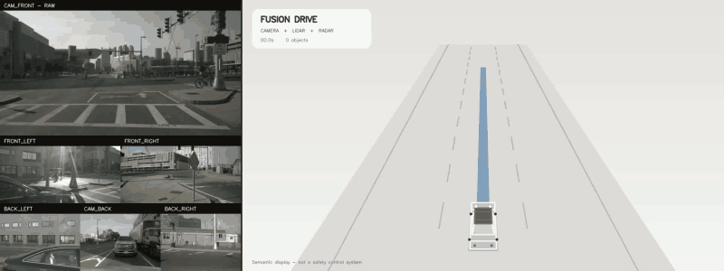
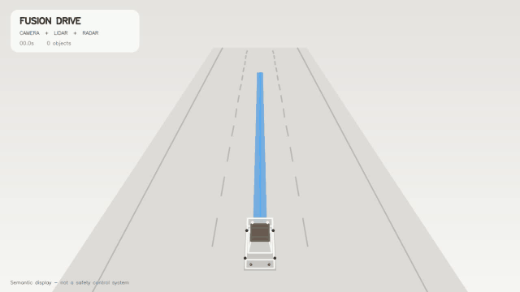
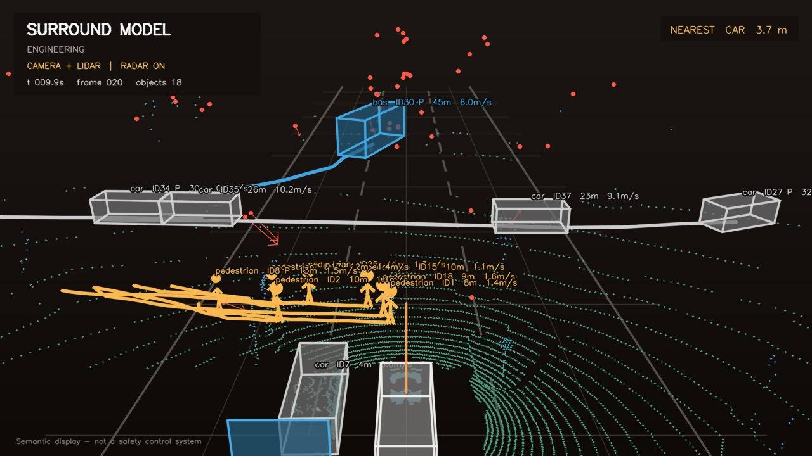
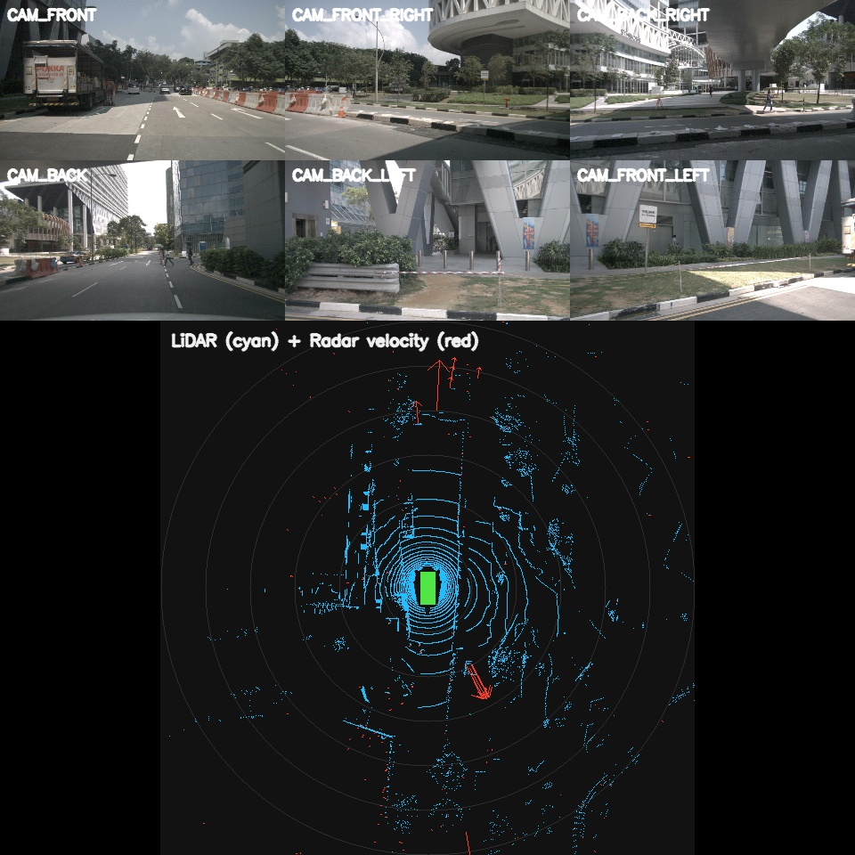
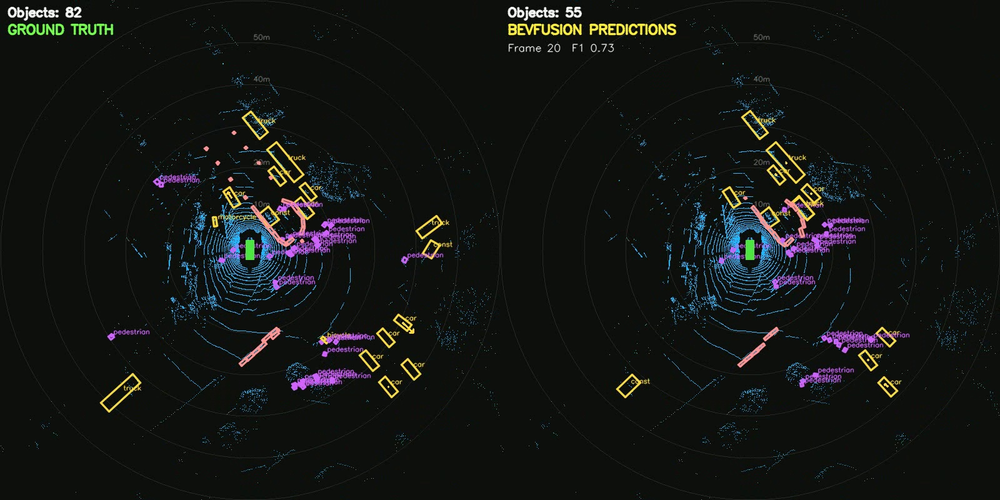
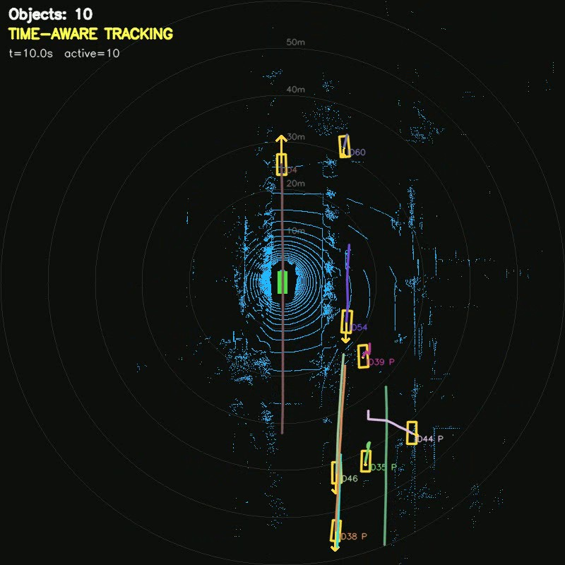
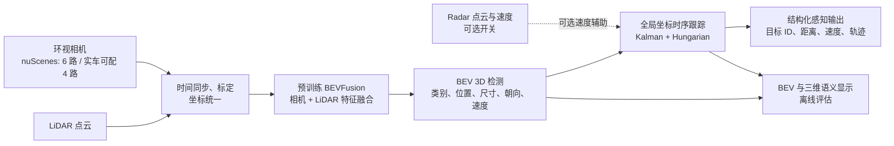

# Multi-Camera, LiDAR, and Radar BEV Perception for Autonomous Driving

面向自动泊车的多相机与激光雷达 BEV 感知融合系统。

The project builds metric Bird's-Eye View representations from surround cameras,
LiDAR, and radar. Parking remains one supported scenario, but the system targets
general urban driving perception, including vehicles, pedestrians, cyclists,
drivable space, distance, velocity, and tracking.

## 当前运行效果

### 1. 真实相机与融合识别同步对照



[查看 1924×720 对照截图](docs/images/real-vs-perception.jpg) ·
[▶ 查看 12 FPS 高清 MP4](docs/videos/real-vs-perception-scene-0553.mp4)

左侧是同一 nuScenes 时刻的六路真实相机：前摄占据上半部分，前侧和后三路
相机位于下方；右侧是 Camera + LiDAR BEVFusion、Radar 速度融合和时序跟踪
生成的三维语义环境。真实相机保持数据集约 2 Hz 的原始关键帧，右侧目标在
相邻感知结果之间按真实时间戳插值到 12 FPS，因此不会把生成画面冒充相机
采样。示例中可以直接对照真实过街行人与右侧识别到的行人目标。

```powershell
$env:PYTHONPATH = "src"
.\.venv\Scripts\python.exe scripts\render_semantic_drive.py `
    --predictions output\bevfusion_mini\scenes\02_scene-0553.json `
    --camera-comparison `
    --video output\real_vs_semantic_smooth.mp4
```

### 2. 语义化三维环境显示



[查看 1280×720 驾驶模式截图](docs/images/semantic-surround-driving.png)

这是新增加的驾驶可视化模式：本车保持在画面中央，周围汽车、公交车、
行人和其他目标根据 BEVFusion 的米制三维位置实时移动。Camera 与 LiDAR
完成主干感知，Radar 默认参与目标速度更新；右上角显示最近目标。主画面
只保留干净的语义模型，接近量产车机的环境呈现方式，而不是显示原始点云。
新版视觉层级参考 Tesla FSD 的浅灰环境、低饱和目标、蓝色路线和重点目标
高亮，但车辆模型、界面和渲染代码均为本项目自行实现，并非 Tesla 官方界面。
车辆加入梯形车舱、玻璃顶、车轮、前后灯和地面阴影。演示按 nuScenes 的
真实时间戳，将 41 个约 2 Hz 感知关键帧平滑插值为 240 帧、12 FPS，完整
播放约 19.9 秒；README 中的 GIF 会自动播放，MP4 保留 1280×720 清晰版本。

[▶ 查看 MP4 动态演示](docs/videos/semantic-surround-scene-0553.mp4)



加入 `--engineering-mode` 后会显示 LiDAR 点云、Radar 点和速度箭头、目标
ID、距离、速度以及历史轨迹。当前道路和车道线是用于表达尺度与方位的参考
平面，还不是模型检测到的真实道路几何；真实车道、路沿和可行驶区域是下一
阶段的感知输出。

```powershell
$env:PYTHONPATH = "src"
.\.venv\Scripts\python.exe scripts\render_semantic_drive.py `
    --predictions output\bevfusion_mini\scenes\02_scene-0553.json

# 如需查看未插值的原始感知关键帧
.\.venv\Scripts\python.exe scripts\render_semantic_drive.py `
    --predictions output\bevfusion_mini\scenes\02_scene-0553.json `
    --no-smooth

# 显示原始传感器与完整跟踪信息
.\.venv\Scripts\python.exe scripts\render_semantic_drive.py `
    --predictions output\bevfusion_mini\scenes\02_scene-0553.json `
    --engineering-mode
```

### 3. 同步多传感器输入



上半部分是 nuScenes 的六路环视相机，下半部分是车辆坐标系下的
LiDAR 点云（青色）和 Radar 速度观测（红色）。项目接口允许分别开关
Camera、LiDAR 和 Radar；迁移到实车时也可以改成四相机配置。

### 4. BEVFusion 三维目标检测



左侧为数据集真值，右侧为预训练 BEVFusion 的输出。青色为 LiDAR 点云，
绿色矩形为本车，黄色框主要表示车辆，紫色表示行人等目标。模型融合相机
图像与 LiDAR 特征，在统一的米制 BEV 坐标系中输出类别、置信度、三维框、
朝向和速度。真值只用于离线评估，不参与模型推理。

### 5. 调参后的时序跟踪



每个目标都有稳定的 `ID`，彩色折线是最近运动轨迹；`P` 表示当前帧暂时
漏检、由卡尔曼滤波短时预测的目标。经过全部 10 个 nuScenes mini 场景的
36 组参数扫描，运动跟踪诊断 IDF1 从 `60.79%` 提升到 `63.15%`，其中
`scene-1077` 从 `23.70%` 提升到 `42.11%`。这些是本项目的管线诊断指标，
不是官方 nuScenes AMOTA/AMOTP 结果。

## 当前系统流程



当前主模型是 **BEVFusion（相机 + LiDAR）**，不是 BEVFormer。Radar 已有
可控读取和跟踪速度融合接口，但尚未进入 BEVFusion 神经网络主干。项目目前
完成的是感知、BEV 检测、时序跟踪与可视化，不包含真实车辆的规划、控制和
CAN 执行；不得直接用于道路车辆安全控制。

## nuScenes mini

The official nuScenes mini split provides 6 cameras, 1 LiDAR, 5 radars, sensor
calibration, ego poses, maps, and 3D object annotations. After extracting it to
`data/external/nuscenes`, install the isolated dataset environment and inspect
the first synchronized sample:

```powershell
python -m venv .venv
.\.venv\Scripts\python.exe -m pip install -e ".[datasets,dev]"
.\.venv\Scripts\python.exe scripts\preview_nuscenes.py
.\.venv\Scripts\python.exe scripts\render_nuscenes_video.py --frames 40
```

The `NuScenesSource` interface independently switches camera, LiDAR, and radar
inputs and transforms point measurements into the ego-vehicle coordinate frame.
It also converts annotated 3D objects from global coordinates to the current ego
frame, including metric size, heading, category, and velocity. The preview draws
all modalities together on a 120 m by 120 m metric BEV.

## Pretrained BEVFusion inference

The local RTX 4070 WSL2 environment uses PyTorch 2.1.2 CUDA 12.1,
MMDetection3D 1.4.0, and the official nuScenes camera+LiDAR BEVFusion checkpoint.
Validate the model inputs before inference:

```powershell
.\.venv\Scripts\python.exe scripts\check_bevfusion_inputs.py
```

The reference voxelizer uses the checkpoint's fixed 108 m square range,
`0.075 x 0.075 x 0.2 m` voxels, and at most 10 points per voxel. The WSL inference
script exports predictions to `output/bevfusion_predictions.json`; render them
without the optional Open3D dependency using:

```powershell
.\.venv\Scripts\python.exe scripts\render_bevfusion_predictions.py
```

The resulting boxes are model predictions, not dataset ground truth. Prediction
centres, headings, and velocities are transformed from the raw LiDAR frame into
the ego-vehicle frame before BEV rendering.

Compare one predicted frame with nuScenes ground truth using class-aware,
one-to-one centre-distance matching:

```powershell
.\.venv\Scripts\python.exe scripts\evaluate_bevfusion.py
```

This writes `output/bevfusion_evaluation.json` and a side-by-side BEV image. It
also sweeps confidence thresholds from 0.1 to 0.9. These figures are a pipeline
diagnostic for one frame, not the official nuScenes validation mAP/NDS score.

For a complete approximately 20-second scene, `run_bevfusion_scene.py` performs
camera+LiDAR inference once per keyframe and `evaluate_bevfusion_scene.py`
produces aggregate metrics plus a ground-truth/prediction comparison video. The
diagnostic uses nuScenes class-specific evaluation ranges (30 m for barriers and
traffic cones, 40 m for pedestrians and two-wheelers, and 50 m for vehicles).

To avoid overfitting decisions to a single clip, run the same pretrained model
over every nuScenes mini scene and then aggregate detection plus motion-only
tracking diagnostics:

```powershell
wsl.exe -d Ubuntu-20.04 --cd /mnt/d/my_project/multi-camera-lidar-bev-perception env PYTHONPATH=/mnt/d/my_project/multi-camera-lidar-bev-perception/src:/mnt/d/my_project/multi-camera-lidar-bev-perception/data/external/mmdetection3d:/mnt/d/my_project/multi-camera-lidar-bev-perception/data/external/mmdetection3d/projects/BEVFusion LD_LIBRARY_PATH=/home/yan/micromamba/envs/bevfusion/lib /home/yan/.local/bin/micromamba run -r /home/yan/micromamba -n bevfusion python scripts/run_bevfusion_batch.py data/external/mmdetection3d/projects/BEVFusion/configs/bevfusion_lidar-cam_voxel0075_second_secfpn_8xb4-cyclic-20e_nus-3d.py data/checkpoints/bevfusion_nuscenes.pth --dataroot data/external/nuscenes --infos data/external/nuscenes/nuscenes_mini_infos_all.pkl --output-dir output/bevfusion_mini/scenes --summary output/bevfusion_mini/batch_summary.json --scene-indices all
.\.venv\Scripts\python.exe scripts\evaluate_bevfusion_batch.py --prediction-dir output\bevfusion_mini\scenes --output output\bevfusion_mini\evaluation_summary.json
```

Use `--scene-indices 0` or `--max-frames-per-scene 2` for a fast smoke test.
The batch summary files stay under `output/` and are intentionally ignored by
Git.

Detection and tracking use separate score thresholds by default: `0.2` for the
detection diagnostic and `0.3` for tracking. The motion tracker defaults
(`4.0 m` association gate and `2.0 s` missed-track retention) were selected by
a 36-configuration grid search over all 10 nuScenes mini scenes. This improved
the aggregate diagnostic IDF1 from `0.6079` to `0.6315`; this remains a local
diagnostic rather than the official nuScenes tracking benchmark.

Reproduce or extend the search without rerunning BEVFusion inference:

```powershell
$env:PYTHONPATH = "src"
.\.venv\Scripts\python.exe scripts\tune_motion_tracker.py
```

If WSL2 fails with `HCS_E_HYPERV_NOT_INSTALLED`, run
`scripts/repair_wsl2_admin.ps1` from an elevated PowerShell session and reboot
Windows before retrying the WSL command.
After WSL2 is working again, `scripts/run_full_mini_after_wsl.ps1` runs the full
mini batch inference and aggregate evaluation in one command.

## Temporal tracking

`track_bevfusion_scene.py` converts per-frame detections from ego coordinates to
the global frame, compensating for ego motion before association. A
constant-velocity Kalman filter uses the real sample timestamps rather than an
assumed fixed frame interval, while class-aware Hungarian matching assigns stable
track IDs. Missing detections are propagated for at most 2.0 seconds.

```powershell
.\.venv\Scripts\python.exe scripts\track_bevfusion_scene.py
```

The output video displays stable IDs, recent trajectories, and a `P` suffix when
a track is temporarily predicted through a missed detection. Radar measurements
are not yet used by this tracker; adding radar velocity is a later fusion step.

Evaluate identity consistency against nuScenes instance IDs with:

```powershell
.\.venv\Scripts\python.exe scripts\evaluate_tracking_ids.py
```

This diagnostic reports ID precision, ID recall, IDF1, ID switches, fragments,
and detection coverage for the seven nuScenes tracking classes. It is not the
official AMOTA/AMOTP benchmark implementation.

An optional `--appearance` flag projects predicted 3D boxes into the six camera
views and adds normalized HSV crop histograms to the association cost. It is kept
off by default: on the current scene it reduced ID switches slightly but also
reduced IDF1, showing that simple color histograms are not robust enough across
different cameras and distant, partially occluded objects.

An optional `--radar` flag associates points from all five nuScenes radars with
each oriented 3D box, rejects velocity outliers, requires at least two returns,
and adds the robust velocity estimate to the Kalman update. This is also off by
default: only about one quarter of detections in the current scene receive a
multi-return radar estimate, and the measured velocity/identity improvement was
negligible. The interface remains available for denser real radar hardware and
later learned radar feature fusion.

For learned appearance, run the tracking scripts inside the existing WSL2
PyTorch environment with `--learned-appearance --appearance-weight 0.25`.
The implementation projects boxes into the best of six camera views and batches
the crops through an ImageNet-pretrained ResNet-18 to obtain normalized 512-D
embeddings. On the current scene this modestly improves IDF1 and reduces ID
switches, but it remains a generic visual encoder rather than a dedicated
vehicle/pedestrian ReID model. Pretrained weights are cached locally and are not
committed to this repository.

## Current MVP

- Four inputs: front, rear, left, and right.
- Configurable perspective projection into one BEV canvas.
- Optional LiDAR branch controlled by `lidar.enabled`.
- LiDAR occupancy, height, and density grids in ego coordinates.
- Camera-only, LiDAR debug, and fused visualization modes.
- Built-in synthetic rig, so the pipeline runs before physical sensors arrive.
- Unit tests for BEV projection and metric LiDAR rasterization.

## Architecture

```text
4 cameras -> undistort/project -> RGB BEV -----------+
                                                      +-> fused BEV outputs
LiDAR (optional) -> ego transform -> occupancy BEV ---+
```

Recognition will be added after geometric calibration is validated:

```text
camera detections + parking-slot geometry + LiDAR occupancy
                         -> structured perception output -> parking planner
```

## Quick start

```powershell
python -m pip install -e .
parking-bev --config configs/demo.yaml --max-frames 120
```

The demo writes `output/demo_bev.mp4` and displays a live preview. Use
`--no-display` on a headless system.

```powershell
parking-bev --config configs/demo.yaml --max-frames 120 --no-display
python -m pytest
```

After cloning the public FB-SSEM repository into
`data/external/FB-SSEM-dataset`, inspect its bundled four-camera sample with:

```powershell
parking-bev --config configs/fb_ssem_sample.yaml --max-frames 30 --no-display
```

The projection quadrilaterals in this sample configuration are placeholders;
they validate data ingestion only and must not be interpreted as calibrated,
metric BEV geometry.

## LiDAR switch

Edit `configs/demo.yaml`:

```yaml
lidar:
  enabled: false  # camera-only mode
```

When disabled, the output schema remains unchanged; LiDAR grids are returned as
zero arrays and the fusion layer falls back to RGB BEV.

## Real sensor integration checklist

1. Capture synchronized frames from all four cameras.
2. Calibrate each camera's intrinsic and distortion parameters.
3. Estimate each camera-to-ego transform and ground-plane projection.
4. Estimate LiDAR-to-ego extrinsics and verify by camera reprojection.
5. Replace the demo destination quadrilaterals with calibrated homographies.
6. Measure BEV scale using known ground control points.

## Coordinate convention

- Ego `x`: forward, in metres.
- Ego `y`: left, in metres.
- Ego `z`: upward, in metres.
- BEV image origin: top-left.
- BEV image up: ego forward.

This repository is an early research prototype and is not a vehicle safety or
control system.
